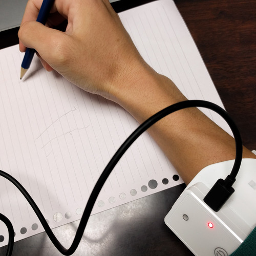
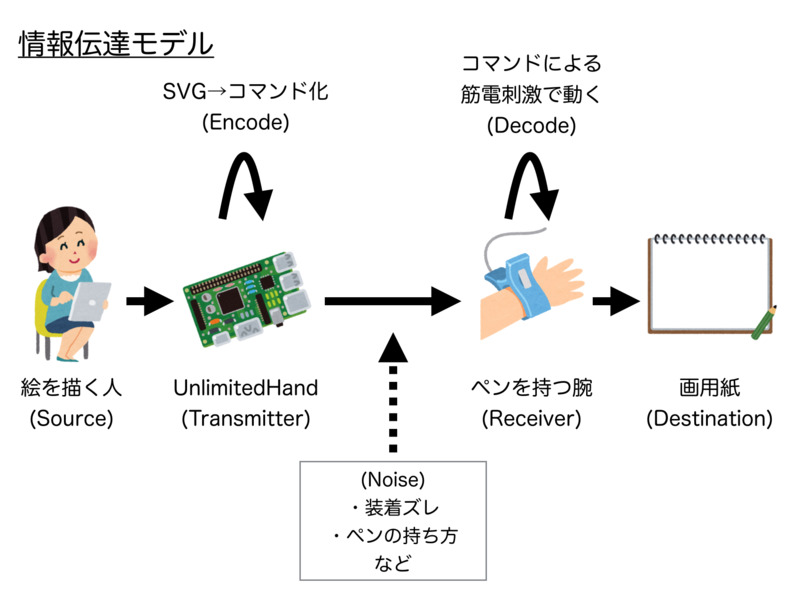

**※※ 実験用リポジトリのため，動作は保証しません ※※**

UnlimitedPaint
=====

UnlimitedPaint は [UnlimitedHand](http://unlimitedhand.com/) を利用した自動お絵かき HMI です。

デモ
-----

操作者がブラウザに絵を描くと，被操作者の腕が勝手に（！）うごいて絵を描きます。

*← 操作者の画面 / 被操作者の映像 →*

腕には UnlimitedHand を巻いています。

アーキテクチャ
-----

ポイントはSVGから筋電刺激信号へのエンコード部分です。

Firebase を介してインターネット越しに操作できるようになっています。

セットアップ方法
-----

準備中

残課題メモ
-----

* 基底ベクトルの選び方
* マイナス方向には動けない問題
* そもそも経路を無視している件
* 生体ノイズに対するロバスト性
* フィードバック制御
* etc.
